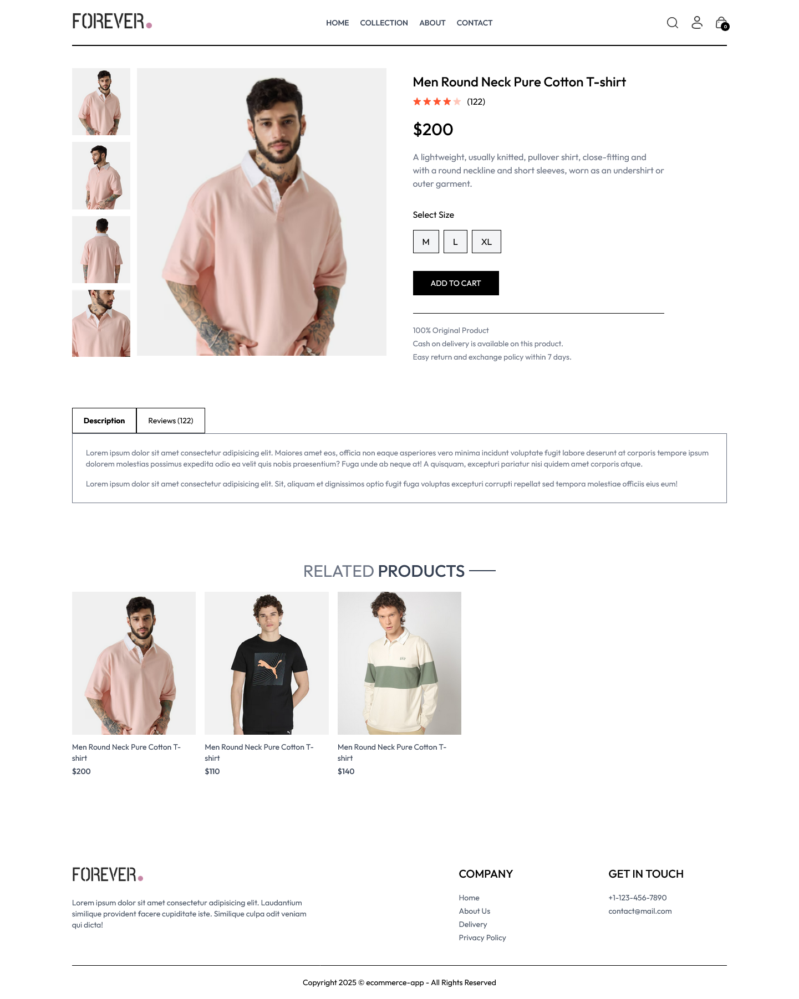
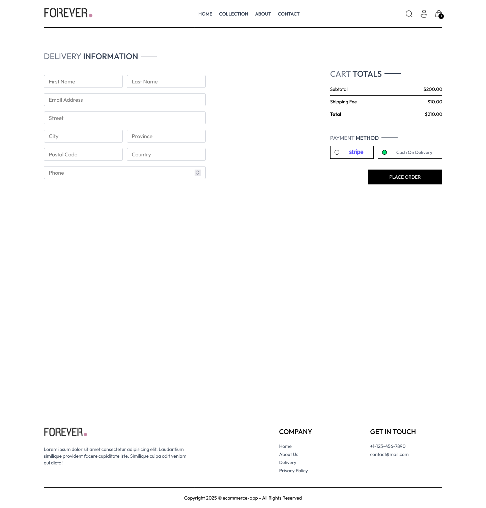

## 🎯 Project Overview

ecommerce-app is a modern, full-stack eCommerce web application built with the **MERN stack**, offering seamless product browsing, secure authentication, and integrated payment processing using **Stripe**.

## 💡 Key Features

- 🛍️ Product catalog with image uploads and Cloudinary storage
- 🧾 Secure checkout flow with Stripe integration
- 🔐 User authentication and authorization with JWT & bcrypt
- 📸 Image uploads handled with Multer and stored via Cloudinary
- 🔍 Form validation with `validator`
- 🧭 Client-side routing with React Router
- ⚡ Built with Vite for fast development
- 🌐 Fully responsive design using Tailwind CSS

## 🛠️ Technologies Used

- **React 18** — UI Library
- **Vite** — Modern frontend tooling
- **React Router** — Client-side routing
- **Tailwind CSS** — Utility-first CSS framework
- **Node.js + Express** — Backend server
- **MongoDB + Mongoose** — NoSQL database and ORM
- **Stripe API** — Payment processing
- **Multer** — File upload middleware
- **Cloudinary** — Image storage and CDN
- **JWT (jsonwebtoken)** — Token-based auth
- **Bcrypt** — Password hashing
- **Validator** — Form validation
- **Render.com** — Deployment platform

## 📸 Screenshots

  
  

## 🔗 Links

- Backend: https://ecommerce-app-xwev.onrender.com
- Frontend: https://ecommerce-app-1-bbbk.onrender.com
- Admin Dashboard: https://ecommerce-app-admin-c8id.onrender.com
